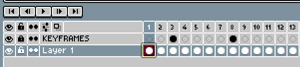

# Keyframes

An Aseprite extension that allows you to add and jump between keyframes in the timeline!

## How to Use Keyframes

1. Download this extension by visiting the releases page! (Double click the extension once downloaded to install)
2. In Aseprite, you can find the new menu options under the `Frames` menu.
3. Check out the [Accessing Keyframes Controls](#accessing-keyframes-controls) below to see how you can access the Keyframes functionality!

## What is a Keyframe?

A Keyframe is an idea taken from other programs that also have timelines. While keyframes also have a formal definition in animation, for the purpose of this plugin, a Keyframe is simply a saved frame that you'd like to access quickly. That way, instead of trying to remember which frames you deem important or special, you can save them with plugin, then use the `Go To Previous Keyframe` or `Go To Next Keyframe` to jump between them.

Keyframes are stored on a special layer created for you when you add your first keyframe. It is titled "KEYFRAMES". The script will lock this layer so that you don't accidentally draw on it. As you can see in the image below, a Keyframe is a frame on the KEYFRAMES layer that has the cel filled. A normal frame is one with an empty cel. This is your visual indicator of where a keyframe has been placed.

## Accessing Keyframes Controls
1. From the menu (the simplest method):
    * Click the `Frames` menu
    * Choose an option from the dropdown (add, delete, previous, or next)
2. From a dialog window:
    * Click the `Frames` menu
    * Select `Open Keyframe Editor`
    * Use the pop-up to add, delete, or jump between keyframes
3. From keyboard shortcuts:
    * Open the shortcut editor (`Edit > Keyboard Shortcuts`)
    * Use the search bar at the top left and type `Keyframe`
    * Add shortcuts as needed to each menu item

## Credits

This extension was commissioned by [@qamaart](https://twitter.com/qamaart) on Twitter. He also created the banner image at the top of this page! He's an incredible artist and I highly recommend you follow his work.

As an advocate of open-source software, feel free to suggest edits, or just fork this repository and make your own! The license on this software is open for commercial and private use. This extension will remain free forever; however, if you'd like to buy me a coffee, you can do so here: 

